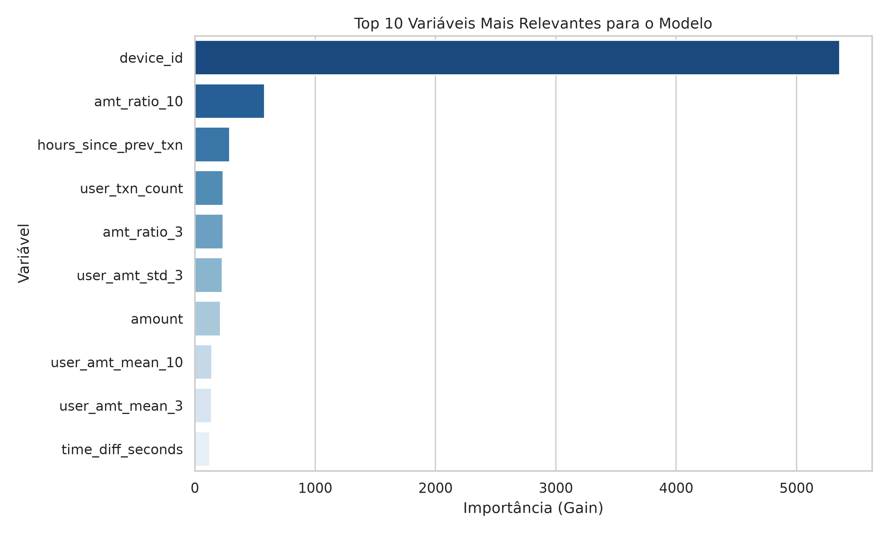
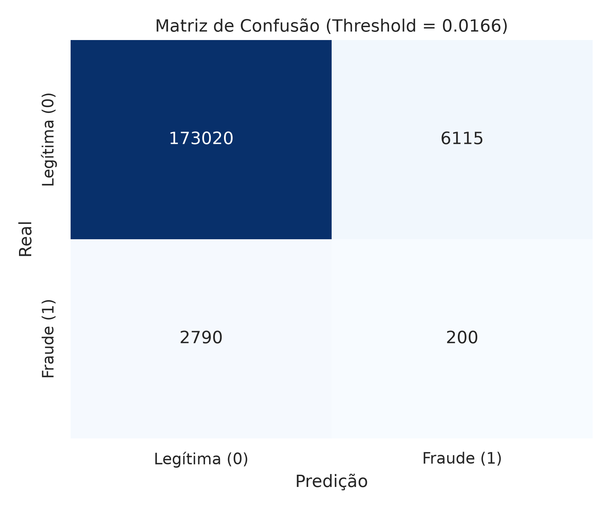

# Detecção de Fraude Comportamental em Transações Financeiras

Projeto de Machine Learning voltado para a detecção de anomalias e transações fraudulentas em fluxos bancários com alto desbalanceamento de classes (~1.6% de fraudes).

## Arquitetura e Decisões Técnicas

1. **Engenharia de Atributos Sequenciais:**
   - Cálculo de deltas de tempo (`time_diff_seconds`) e velocidade transacional (`txn_velocity`).
   - Janelas móveis de histórico do usuário (médias e desvios de valor em 3 e 10 transações).
   - Rastreamento de desvio de contexto (mudança repentina de `device_id` ou `country`).

2. **Estratégia de Validação (Anti-Leakage):**
   - Utilização de **GroupKFold (5 splits)** agrupado por `user_id`.
   - Garante que transações de um mesmo usuário não coexistam no treino e na validação, simulando a chegada de novos clientes no mundo real.

3. **Modelagem:**
   - **LightGBM Classifier** otimizado para métricas de ranking e precisão/recall (PR-AUC / ROC-AUC).
   - Calibração de limiar de decisão (*Threshold Tuning*) via curva Precision-Recall.

## Resultados e Visualizações

### Importância das Variáveis


### Matriz de Confusão


## Estrutura do Repositório

```text
├── notebooks/           # Notebooks de análise exploratória e modelagem
├── reports/figures/     # Gráficos e resultados exportados
├── requirements.txt     # Dependências do ambiente
└── README.md            # Documentação técnica do projeto